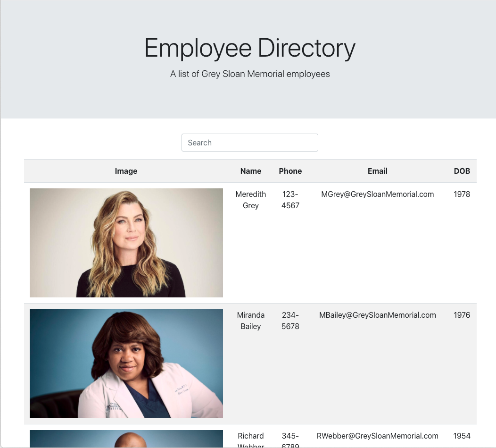

# Employee-Directory 

## Description 

An app that displays the employees of Grey-Sloan Memorial hospital. It gives information on how to get in touch with each employee via phoen and email. You can search the directory for a specific employee and sort by last name. 
 Check it out here [here]()

## Usage 

Below is an image of the directory. It displays an image, name, phone number, email and DOB of each employee. 

    

## Questions
 Please forward any questions to [email(fay.ashbrgmail.com) . Please refer to the code for this project and others at [https://github.com/afbrown1216](https://github.com/afbrown1216).

## License 

Copyright (c) afbrown1216. 
Licensed under the MIT license.